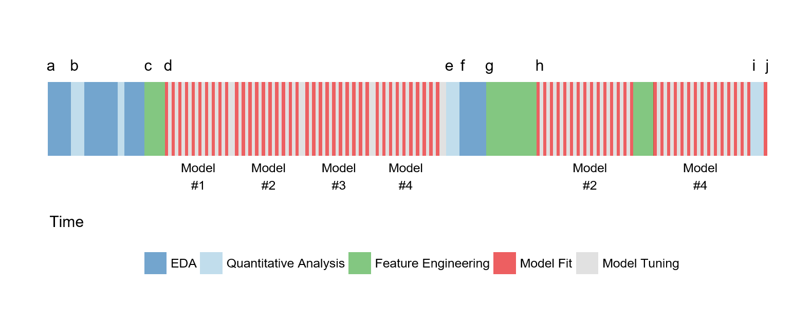

```{r setup, include=FALSE}
knitr::opts_chunk$set(echo = TRUE)
knitr::opts_chunk$set(message = FALSE)
```

```{r load packages, message=FALSE, warning=FALSE}
library(tidymodels)
library(tidyverse)

library(AmesHousing)
library(skimr)
library(ggridges)

theme_set(theme_bw())
```


# Applied Machine Learning - rstudio::conf 2019

Working materials for the *Applied Machine Learning* workshop given at rstudio::conf 2019 in Austin, Texas. Workshop materials available on Github *[here](https://github.com/topepo/rstudio-conf-2019)*.

## Background

* Two methods for specifying what terms to model. Not all models have both.
* Some models (99%) automatically generate dummies, some don't.
* Sparse matrices can be used (unless they can't).
* Different packages have different interfaces to call for the same requests.

### Different Philosophies - `caret`/`tidymodels`

`caret` is the primary package for _untidy_ predictive modelling:

1. More traditional R coding style
2. High-level syntax
3. Comprehensive, less modular style
4. Many optimizations / easy to parallelize

`tidymodels` espouses the `tidyverse` approach:

1. Re-use existing data structures
2. Compose simple functions with the pipe `%>%`
3. Embrace functional programming
4. Design for humans (not machines)

`tidymodels` is a collection of tidy packages: `dials`, `infer`, `parsnip`, `recipes`, `rsample`, `yardstick`. Other packages are in development: `tidypredict`, `tidyposterior`, `tidytext`.

### Datasets used

* Ames IA housing data. 2,930 properties in the data, includes sale price with a bunch of other predictors.
* fueleconomy.gov data. 4,595 cars including fuel efficiency and some predictors.
* OKCupid data. 50,000 profiles with several types of fields including interests, descriptions, profession, diet, gender, languages etc. No usernames or pictures.

## Day 1

Read in Ames pricing data and process. Note use of `read_delim` and `rename_at`.

```{r read_data}
ames_prices <- "http://bit.ly/2whgsQM" %>%
  read_delim(delim = "\t") %>%
  rename_at(vars(contains(' ')), funs(gsub(' ', '_', .))) %>% 
  rename(Sale_Price = SalePrice) %>%
  filter(!is.na(Electrical)) %>%
  select(-Order, -PID, -Garage_Yr_Blt)

ames_prices %>%
  group_by(Alley) %>%
  summarize(
    mean_price = mean(Sale_Price / 1000),
    n = sum(!is.na(Sale_Price))
  )
```

### `purrr` is an under-utilized package!

Use `map()` instead of `lapply`/`vapply`.

`map` always returns a list, use suffixed versions if you knw what you want back e.g. `map_int`.

```{r purrr}
library(purrr)

mini_ames <- ames_prices %>%
  select(Alley, Sale_Price, Yr_Sold) %>%
  filter(!is.na(Alley))

by_alley <- split(mini_ames, mini_ames$Alley)
map(by_alley, head, n = 2)

```

```{r purrr split}
ames_lst_col <- nest(mini_ames, Alley) # Create a dataframe in a dataframe

ames_lst_col <- nest(mini_ames, -Alley)
ames_lst_col

ames_lst_col %>%
  mutate(
    n_row = map_int(data, nrow),
    max   = map_dbl(data, ~max(.x$Sale_Price))
  )
```

### Quasiquotation

`quasiquotation` allows us to programatically insert arguments into an expression.

```{r}
mtcars %>% select(mpg, wt, hp)

# What about this?
cols <- c("mpg","wt","hp")
value <- 5

mtcars %>% select(!!!cols) %>% mutate(value = !!value)
```

TRIPLE BANG (`!!!`) is used when you have a function that wants three dots (e.g. `select`)
DOUBLE BANG (`!!`) is used when the argument can only have one value

### AmesHousing Exploration
```{r load Ames housing and explore}
ames <- AmesHousing::make_ames()
#ames %>% skimr::skim()

# Average bedrooms per pool type
ames %>%
  mutate(decade_built = as.factor(floor(Year_Built / 10) * 10)) %>%
  ggplot(aes(x = decade_built, y = Sale_Price)) +
  geom_boxplot() +
  theme_bw()
```

### Getting stuck in

Typical modelling process:

### Simple Linear Models
```{r training testing splitting using rsample}
library(AmesHousing)
ames <-
  make_ames() %>%
  dplyr::select(-matches("Qu"))

nrow(ames)

set.seed(4595)

data_split <- initial_split(ames, strata = "Sale_Price")
ames_train <- training(data_split)
ames_test <- testing(data_split)

ggplot() +
  geom_line(data = ames_train,
            stat = "density",
            trim = TRUE,
            aes(x = Sale_Price)) +
    geom_line(data = ames_test,
            stat = "density",
            trim = TRUE,
            col = "red",
            aes(x = Sale_Price))
```

```{r simple linear model}
simple_lm <- lm(log10(Sale_Price) ~ Longitude + Latitude, data = ames_train)
plot(simple_lm)

simple_lm_values <- broom::augment(simple_lm) # Creates a nice data frame with values, predictors, residuals etc.

# Observed versus fitted
simple_lm_values %>%
  ggplot(aes(x = .fitted, y = log10.Sale_Price.)) +
  geom_point(alpha = 0.5) +
  geom_abline(slope = 1, intercept = 0) +
  geom_smooth(se = F)

simple_lm_values %>%
  ggplot(aes(x = .resid)) +
  geom_histogram() +
  geom_vline(xintercept = 0)

# Hat values - distance to center of training set (e.g. center of town)
simple_lm_values %>%
  ggplot(aes(x = .hat, y = .resid)) +
  geom_point(alpha = 0.5)
```

### Parsnip

*A tidy, unified interface to models.*

Parsnip process:

* Create specification
* Set the engine
* Fit the model

```{r}
library(parsnip)

# We just want to do a linear regression
spec_lin_reg <- linear_reg()
spec_lin_reg

# Different engine types allow us to make the same TYPE of model 
#  using different calculation engines
spec_lm <- spec_lin_reg %>% set_engine("lm")
spec_lm

spec_stan <- spec_lin_reg %>% set_engine("stan", chains = 4, iter = 1000)
spec_stan

# Fitting process is identical - just pass different specifications
fit_lm <- parsnip::fit(
  spec_lm,
  log10(Sale_Price) ~ Latitude + Latitude,
  data = ames_train
)

fit_stan <- parsnip::fit(
  spec_stan,
  log10(Sale_Price) ~ Latitude + Latitude,
  data = ames_train
)

coef(fit_lm$fit)
coef(fit_stan$fit)

summary(fit_lm$fit)
summary(fit_stan$fit)
```

### Resampling

*N.B. on terminology:* Training/test is the split on the top-level data, Analysis/assessment is the split _inside_ the resample.

#### V-fold cross validation

* Embarrassingly parallel
* Always just use 10-folds
* Each data point only used in *one* assessment set

*Max tends to favor 5 REPEATS of 10-fold cross-validation.*

For example 10% of the Ames data is approx. 219 data points - probably good to estimate RMSE and R^2.

#### Bootstrap

Bootstrap has good variance properties but bias is poor.

* Analysis set: each point is selected with replacement
* Assessment set: unique points not selected in the Analysis set

#### Cross-Validation in `rsample`

There's a nice function in `rsample` that creates v-fold cross validation splits: `vfold_cv`.

This function produces a tibble/dataframe with a list column.
```{r}
set.seed(2453)

cv_splits <- rsample::vfold_cv(
  data = ames,
  v = 10,
  strata = "Sale_Price"
)

# This is now ONE split
cv_splits$splits[[1]]

# analysis() lets us get the data out
cv_splits$splits[[1]] %>% analysis()

```

Using `purrr` to fit the model.

```{r}
library(parsnip)

## Different engine types allow us to make the same TYPE of model 
#  using different calculation engines
spec_lm <- parsnip::linear_reg() %>% parsnip::set_engine("lm")

# What is the formula of the model
geo_formula <- log10(Sale_Price) ~ Latitude + Longitude

# Create a function that fits the model on a SINGLE cv split/resample
fit_model <- function(split, spec) {
  fit(
    object = spec,
    formula = geo_formula,
    data = analysis(split)
  )
}

# For each resample, call fit_model()
# Add a new list column containing the fit to our cv splits
cv_splits <- cv_splits %>% 
  mutate(models_lm = map(splits, fit_model, spec_lm))
```

Structure of the results contains this `<fit[+]>` column indicating the model has been fit.

Need a function to append the predictions to the CV splits column
```{r}
compute_pred <- function(split, model) {
  
  # Extract the assessment set
  assess <- assessment(split) %>%
    mutate(Sale_Price_Log = log10(Sale_Price))
  
  # Compute predictions (a df is returned)
  pred <- predict(model, new_data = assess)
  
  bind_cols(assess, pred)
}

cv_splits <- cv_splits %>%
  mutate(
    pred_lm = map2(splits, models_lm, compute_pred)
  )

cv_splits
```

Calculating performance. Same process.

```{r}
compute_perf <- function(pred_df) {
  # Create a function that calculates
  # rmse and rsq and returns a data frame
  numeric_metrics <- metric_set(rmse, rsq)
  numeric_metrics(
    pred_df, 
    truth = Sale_Price_Log, 
    estimate = .pred
  )
}

cv_splits <- cv_splits %>%
  mutate(perf_lm = map(pred_lm, compute_perf))

select(cv_splits, pred_lm, perf_lm)

cv_splits$perf_lm[[1]]
```

Now we want to `unnest` all of this stuff so we can compute performance across the cv splits
```{r}
cv_splits

cv_splits %>% 
  unnest(perf_lm)

cv_splits %>%
  unnest(perf_lm) %>%
  group_by(.metric) %>%
  summarise(
    .avg = mean(.estimate),
    .sd = sd(.estimate)
  )

```

So we've done 10-fold cross validation and we want to work with *holdout/out-of-sample* residuals.

Nice to examine these out of sample residuals using EDA to see if we're missing anything.
```{r}
holdout_residuals <- cv_splits %>%
  unnest(pred_lm) %>%
  mutate(.resid = Sale_Price_Log - .pred)

holdout_residuals %>%
  ggplot() +
  geom_point(aes(x = Neighborhood, y = .resid, colour = id), alpha = 0.5) +
  geom_boxplot(aes(x = Neighborhood, y = .resid), alpha = 0.2) +
  coord_flip()

holdout_residuals %>%
  mutate(house_age = 2019 - Year_Built) %>%
  ggplot(aes(x = house_age, y = .resid)) +
  geom_point() +
  geom_smooth()
```

#### More complicated models - kNN

Reminder, with kNN - a smaller _k_ means a more flexible model (could overfit), and a larger _k_ could mean over-smoothing.

*Typically* with kNN/distance-metrics we would scale predictors however with lat/lon we are ok.

```{r knn using parsnip}

spec_knn <- parsnip::nearest_neighbor(neighbors = 2) %>% parsnip::set_engine("kknn")
spec_knn

fit_knn <- fit(spec_knn, geo_formula, ames_train)
fit_knn
```

```{r}
# Predict on the same data you train with
repredicted <- fit_knn %>%
  predict(new_data = ames_train) %>%
  bind_cols(ames_train) %>%
  dplyr::select(.pred, Sale_Price) %>%
  mutate(Sale_Price_Log = log10(Sale_Price))

repredicted
```

We can use `yardstick` to quickly calculate performance metric on the training data but this is a *naughty no-no* because we're using the training data to calculate it...
```{r calculate r-sq ON THE TRAINING SET}
# Don't do this normally, just shows performance on the training set
repredicted %>%
  yardstick::rsq(
    truth = Sale_Price_Log,
    estimate = .pred
  )
```

Really we should use these cross-validated/analysis data to calculate this
```{r}
cv_splits <- cv_splits %>%
  mutate(
    # Fit a knn model for each split
    models_knn = map(splits, fit_model, spec_knn),
    
    # Generate predictions on the assessment set
    pred_knn = map2(splits, models_knn, compute_pred),
    
    # Calculation performance
    perf_knn = map(pred_knn, compute_perf)
  )

# Unnest & compute resampled performance estimates
cv_splits %>%
  unnest(perf_knn) %>%
  group_by(.metric) %>%
  summarise(
    .estimate_mean = mean(.estimate),
    .estimate_sd = sd(.estimate)
  )
```
Formal comparisons are important. What this means is that we probably want to consider the fact that certain folds will be better predicted and others will be worse predicted. *In other words, there is usually a within-resample correlation. For the two models, the estimated correlation in RMSE values is 0.671.* 

I.e. we want to keep the matching in mind when we consider performance...

```{r}
extract_rmse <- function(perf_list) {
  perf_list %>%
    bind_rows() %>%
    filter(.metric == "rmse") %>%
    pull(.estimate)
}

rmse_lm <- extract_rmse(cv_splits$perf_lm)
rmse_knn <- extract_rmse(cv_splits$perf_knn)

rs_comp <- data.frame(
	rmse = c(rmse_lm, rmse_knn),
	Model = rep(c("Linear\nRegression", "2-NN"), each = nrow(cv_splits)),
	Resample = cv_splits$id
)

ggplot(rs_comp, aes(x = Model, y = rmse, group = Resample, col = Resample)) + 
  geom_point() + 
  geom_line() + 
  theme(legend.position = "none")
```

We can use a paired t-test to perform a comparison:
```{r}
t.test(rmse_lm, rmse_knn, paired = TRUE)
```

#### Grid Search

*The bad news*
- All models involved in grid search (except final one) are thrown out

*The good news*
- We can easily parallelize

*`dials`* is a new package for filling in varying parameters with a tuning grid (huh?)

```{r}
neighbours
```

## `recipes` / Feature Engineering

```{r}
library(tidymodels)
library(recipes)

```

`recipes` provides an interface to performing feature engineering.

Things to worry about:-

* Dummy variables
* Infrequent factor levels (novel factor levels)
* Zero variance predictors:-
** Filter them out
** Recode factors so that infrequent predictors are pooled into "other" category

*Likelihood encodings:* effect or likelihood encodings of categorical predictors estimate the mean effect of the outcome for every factor level in the predictor. These estimates are used in place of the factor levels. Shrinkage/regularization can improve these approaches.

*`recipes` is like `dplyr` for `model.matrix`*

 recipe  -->    prep    --> bake/juice
(define) --> (estimate) --> (apply)

1. First we define the recipe using the `recipe` function.
```{r define recipe}
mod_rec <- recipe(
    Sale_Price ~ Longitude + Latitude + Neighborhood,
    data = ames_train
  ) %>%
  step_log(Sale_Price, base = 10) %>%
  
  # Note for NEW data we wouldn't have this variable so we can use skip...
  # step_log(Sale_Price, base = 10, skip = T) %>%
  
  # Bucket all categorical levels less than 5% of data
  # This is pretty dope because if it sees NEW levels in the TEST DATA they will get bucketed into Other but no fail
  step_other(Neighborhood, threshold = 0.05) %>% 
  step_nzv(starts_with("Neighborhood_")) %>%
  step_dummy(all_nominal()) # We can use dplyr selectors here too

mod_rec
```

2. When we want to `prep` the recipe it's done on the *training set*:
```{r prep recipe}
mod_rec_trained <- recipes::prep(mod_rec,
                                 training = ames_train,
                                 verbose = TRUE)

mod_rec_trained
```
*Note* by default the `prep` step actually keeps the fully prepared training dataset in memory (change this with the `retain=T` flag). If you want to just get it out use `juice` (returns the FULLY PREPARED TRAINING SET from the prepped recipe):

```{r}
mod_rec_trained %>% juice()
```


3. To apply the recipe to any data set, use `bake()`
```{r bake the recipe (test set)}
ames_test_dummies <- bake(mod_rec_trained, new_data = ames_test)
ames_test_dummies
```

Pre-processing e.g. `step_BoxCox`, `step_pca` should always be done *inside the resample* because then the data has a chance to say whether it's positively influential or not.

#### Interactions
Cool feature to use `step_interact` to specify dynamic interaction terms...

```{r}
recipe(Sale_Price ~ Year_Built + Central_Air, data = ames_train) %>%
  step_log(Sale_Price) %>%
  step_dummy(Central_Air) %>%
  step_interact(~ starts_with("Central_Air"):Year_Built) %>% # NOTE THE ~!! %>% could use all_predictors():all_predictors()!!!!!
  
  prep(training = ames_train) %>%
  juice() 
```

#### Linear Models Again

*NB* Recipes do not include an intercept by default. Also - interaction terms should be coded as `step_interaction` - not in the formula.

```{r}
lin_terms <- recipe(Sale_Price ~ Bldg_Type + Neighborhood + Year_Built + Gr_Liv_Area + Full_Bath + Year_Sold + Lot_Area + Central_Air + Longitude + Latitude, data = ames_train) %>%
  step_log(Sale_Price, base = 10) %>% # Log transform
  step_BoxCox(Lot_Area, Gr_Liv_Area) %>% # BC transform
  step_other(Neighborhood, threshold = 0.05)  %>% # Replace others / collapse levels
  step_dummy(all_nominal()) %>% # Create dummies
  step_interact(~ starts_with("Central_Air"):Year_Built) # Add interactions here

nonlin_terms <- lin_terms %>%
  step_bs(Longitude, Latitude, options = list(df = 5))
```

So now we want to run this recipe across each of the analysis data frames in our `cv_splits` object.

Slight problem is that the `cv_splits` is actually this weird rsplit object. So there's a helper function called `prepper` that allows us to easily map the recipe to cv_splits:


```{r prep recipe for cv split training}
cv_splits <- cv_splits %>% 
  mutate(nonlin_terms = map(splits, prepper, recipe = nonlin_terms))

cv_splits$nonlin_terms[[1]] %>% juice()
```

Create a model specification
```{r}
spec_lm <- parsnip::linear_reg() %>% parsnip::set_engine("lm")

lm_fit_rec <- function(rec_obj, formula) {
  fit(spec_lm, formula, data = juice(rec_obj))
}

cv_splits <- cv_splits %>% 
  mutate(models = map(
    nonlin_terms, 
    lm_fit_rec, 
    Sale_Price ~ .)
  )

glance(cv_splits$models[[1]]$fit)
```

Apply 
```{r}
assess_predictions <- function(split, recipe, model) {
  raw_assessment <- assessment(split)
  processed <- bake(recipe, new_data = raw_assessment)
  model %>%
    predict(new_data = processed) %>%
    bind_cols(processed) %>%
    mutate(
      # Sale_Price is already logged by the recipe
      .resid = Sale_Price - .pred,
      # Save the original row number of the data
      .row = as.integer(split, data = "assessment")
    )
}
```


Ok at this point I'm in a total wtf moment. `pmap` has a list of lists apparently. Super great.

```{r}
cv_splits <- cv_splits %>%
  mutate(
    pred = pmap(
      list(
        split  = splits, 
        recipe = nonlin_terms, 
        model  = models
      ),
      assess_predictions 
    )
  )
```

Using `yardstick` to assess our model:
```{r}
cv_splits %>%
  unnest(pred) %>%
  group_by(id) %>%
  metrics(truth = Sale_Price, estimate = .pred) %>%
  group_by(.metric) %>%
  summarise(
    resampled_estimate = mean(.estimate)
  )
```

Graphical checks for goodness of fit:
```{r}
assess_pred <- cv_splits %>%
  unnest(pred) %>%
  mutate(
    Sale_Price = 10 ^ Sale_Price,
    .pred = 10 ^ .pred
  ) 
ggplot(
    assess_pred,
    aes(
      x = Sale_Price, 
      y = .pred
    )
  ) + 
  geom_abline(lty = 2) + 
  geom_point(alpha = .4)  + 
  geom_smooth(se = FALSE, col = "red")
```

